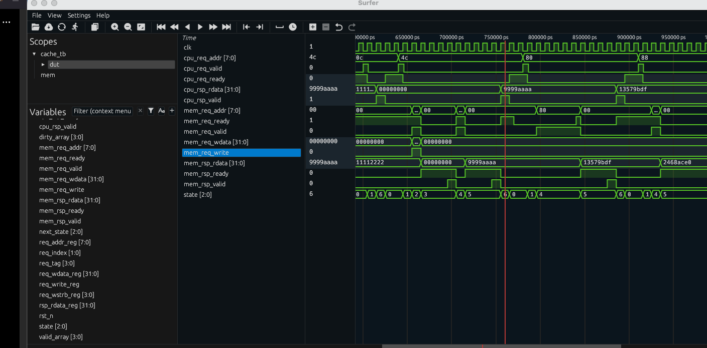
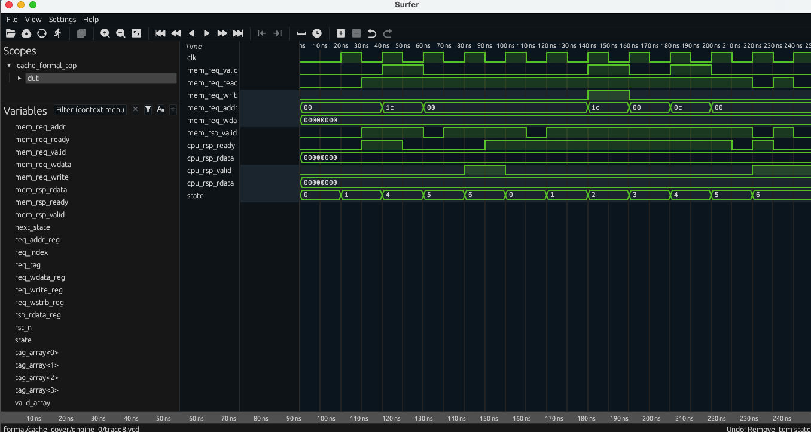

# Formal Verification of a Direct-Mapped Cache Controller

A SystemVerilog implementation and formal verification project for a small
direct-mapped, write-back cache controller.

The project demonstrates:

- synthesizable RTL design
- cache hits and misses
- write-back and write-allocate behavior
- dirty eviction
- partial-byte writes using `WSTRB`
- ready/valid backpressure
- SystemVerilog assertions
- symbolic inputs
- tracked-address data verification
- formal cover properties
- counterexample-driven debugging
- proof decomposition
- verification automation

The design is intentionally small so that cache-control correctness and formal
verification methodology remain the primary focus.

---

## Verification Status

| Verification activity | Result |
|---|---|
| Verilator RTL lint | PASS |
| Ten-scenario directed simulation | PASS |
| Unbounded control and protocol safety proof | PASS |
| 22-cycle bounded symbolic data-integrity proof | PASS |
| Formal cover analysis | PASS |
| Wrong writeback-address fault injection | Detected |
| Broken-WSTRB fault injection | Detected |

Precise result:

> The controller passed directed simulation, an unbounded safety proof for the
> implemented control and protocol assertions, a 22-cycle bounded symbolic
> data-integrity proof, and formal cover analysis. Two intentionally injected
> defects were detected through formal counterexamples at step 9.

---

## Cache Configuration

| Feature | Configuration |
|---|---|
| Address width | 8 bits |
| Data width | 32 bits |
| Number of cache lines | 4 |
| Words per cache line | 1 |
| Placement | Direct mapped |
| Write policy | Write-back |
| Write-miss policy | Write allocate |
| CPU outstanding requests | 1 |
| Memory outstanding requests | 1 |
| CPU address alignment | 32-bit word aligned |
| Backpressure | Supported |

---

## Address Decomposition

The cache uses 8-bit byte addresses:

```text
Address: [7:4] [3:2] [1:0]
          Tag   Index Offset
```

| Field | Bits | Purpose |
|---|---|---|
| Tag | `[7:4]` | Identifies the memory word stored in a line |
| Index | `[3:2]` | Selects one of four cache lines |
| Byte offset | `[1:0]` | Selects a byte within the 32-bit word |

Only word-aligned requests are supported:

```systemverilog
cpu_req_addr[1:0] == 2'b00
```

Example conflict:

```text
0x04 -> tag 0000, index 01
0x44 -> tag 0100, index 01
```

These addresses map to the same cache line but have different tags.

---

## Cache-Line Structure

Each cache line contains:

```text
Valid bit
Dirty bit
Tag
32-bit data word
```

The central cache invariant is:

```text
dirty -> valid
```

A line cannot be dirty unless it contains a valid cache entry.

---

## Architecture

```text
                     +---------------------------+
 CPU request ------> |                           |
 CPU response <----- |  Direct-Mapped Cache      |
                     |  Controller               |
                     |                           |
 Memory request ---> |  4 cache lines            |
 Memory response <-- |  1 word per line          |
                     +---------------------------+
```

The controller is blocking. It processes one CPU transaction at a time and
permits only one outstanding memory transaction.

---

## Controller States

The finite-state machine contains the following states:

```text
IDLE
LOOKUP
WRITEBACK_REQ
WRITEBACK_WAIT
REFILL_REQ
REFILL_WAIT
RESPOND
```

Typical read-hit path:

```text
IDLE -> LOOKUP -> RESPOND -> IDLE
```

Clean read-miss path:

```text
IDLE
  -> LOOKUP
  -> REFILL_REQ
  -> REFILL_WAIT
  -> RESPOND
  -> IDLE
```

Dirty conflict-miss path:

```text
IDLE
  -> LOOKUP
  -> WRITEBACK_REQ
  -> WRITEBACK_WAIT
  -> REFILL_REQ
  -> REFILL_WAIT
  -> RESPOND
  -> IDLE
```

---

## Supported Operations

### Read hit

The selected cache line is valid and its tag matches the requested tag.

The cached data is returned directly to the CPU without a memory request.

### Write hit

The selected bytes are updated using `WSTRB`.

```text
WSTRB bit = 1 -> replace corresponding byte
WSTRB bit = 0 -> preserve corresponding byte
```

The line remains valid and becomes dirty.

### Clean miss

A clean or invalid victim does not require writeback.

The requested word is fetched from memory and installed in the selected line.

### Dirty miss

The dirty victim is written to memory before the requested word is refilled.

The writeback address is reconstructed using:

```systemverilog
{
    stored_victim_tag,
    conflicting_index,
    zero_byte_offset
}
```

### Write allocation

A write miss first refills the complete word from memory.

The CPU write data is then merged using `WSTRB`, and the installed line becomes
dirty.

---

## Ready/Valid Interfaces

A request is transferred only when both `valid` and `ready` are asserted.

CPU request handshake:

```systemverilog
cpu_req_valid && cpu_req_ready
```

CPU response handshake:

```systemverilog
cpu_rsp_valid && cpu_rsp_ready
```

Memory request handshake:

```systemverilog
mem_req_valid && mem_req_ready
```

Memory response handshake:

```systemverilog
mem_rsp_valid && mem_rsp_ready
```

When a valid request or response is stalled, its payload must remain stable
until the handshake completes.

---

## Directed Simulation

The testbench verifies ten scenarios:

1. cold read miss and refill
2. read hit after refill
3. write hit and dirty-bit update
4. read after write
5. partial write using `WSTRB`
6. clean conflict miss
7. dirty conflict miss and writeback
8. memory request backpressure
9. delayed memory response
10. CPU response backpressure

Run:

```bash
make sim
```

Expected result:

```text
PASS: all 10 directed cache scenarios
```

Simulation waveform:



---

## Formal Verification Strategy

The verification work is decomposed into separate proof tasks.

### Unbounded control and protocol proof

Configuration:

```text
formal/cache.sby
Mode: prove
Engine: ABC PDR
```

Run:

```bash
make formal
```

This proves the implemented safety properties without a fixed cycle bound.

The assertions cover:

- reset behavior
- dirty-implies-valid invariant
- hit classification
- captured-request stability
- CPU response stability
- memory request stability
- clean miss behavior
- dirty writeback sequencing
- victim-address reconstruction
- refill behavior
- write-hit behavior
- partial-byte updates

This proof does not claim unconditional transaction completion when the
environment is permitted to stall forever.

### Bounded symbolic data-integrity proof

Configuration:

```text
formal/cache_data.sby
Mode: BMC
Engine: ABC BMC3
Depth: 22 cycles
```

Run:

```bash
make data
```

The proof uses:

```systemverilog
(* anyconst *) logic [ADDR_WIDTH-1:0] f_addr_symbol;
(* anyconst *) logic [DATA_WIDTH-1:0] f_initial_memory_data;
```

The tracked address, initial memory value, CPU write data, and byte strobes are
symbolic.

The checked data properties are:

| Property | Requirement |
|---|---|
| `F_DATA_01` | A read of the tracked address returns the expected value |
| `F_DATA_02` | A resident tracked line contains the expected value |
| `F_DATA_03` | A tracked-address writeback contains the expected value |

This result is bounded through 22 cycles. It is not presented as an unbounded
data proof.

---

## Formal Cover Analysis

Configuration:

```text
formal/cache_cover.sby
Mode: cover
Engine: SMTBMC with Boolector
Depth: 50 cycles
```

Run:

```bash
make cover
```

Reached scenarios include:

| Cover | Scenario | Reached step |
|---|---|---:|
| `C_MISS_01` | Basic cache miss | 4 |
| `C_BACKPRESSURE_01` | Memory request backpressure | 6 |
| `C_REFILL_01` | Refill | 8 |
| `C_BACKPRESSURE_02` | CPU response backpressure | 10 |
| `C_HIT_01` | Cache hit | 14 |
| `C_MISS_02` | Conflict miss | 14 |
| `C_EVICT_01` | Dirty writeback | 14 |
| `C_WRITE_01` | Cache write | 14 |
| `C_WRITE_02` | Partial or allocated write | 14 |
| `C_EVICT_02` | Dirty eviction followed by refill | 24 |

Formal dirty-eviction trace:



The cover results reduce the risk of vacuous assertion success by demonstrating
that important functional paths remain reachable.

---

## Fault Injection

Two intentionally broken RTL copies are included under `formal/`.

The correct implementation in `rtl/cache_controller.sv` remains unchanged.

### Fault 1: Wrong writeback address

Fault file:

```text
formal/cache_controller_bug_wb_addr.sv
```

Injected bug:

```text
Use the incoming request tag instead of the stored victim tag
```

Detected by:

```text
A_EVICT_01_ADDR
```

Failure step:

```text
9
```

Run:

```bash
make fault-wb
```

### Fault 2: WSTRB ignored

Fault file:

```text
formal/cache_controller_bug_wstrb.sv
```

Injected bug:

```text
Overwrite the complete cache word instead of merging enabled bytes
```

Detected by:

```text
F_DATA_02
```

Failure step:

```text
9
```

Run:

```bash
make fault-wstrb
```

Run both fault injections:

```bash
make faults
```

The Makefile treats the expected assertion failures as successful bug
detection.

---

## Repository Structure

```text
formal-cache-controller/
├── Makefile
├── README.md
├── docs/
│   ├── architecture.md
│   ├── assumption-audit.md
│   ├── counterexample_reports.md
│   ├── dirty-eviction-waveform.png
│   ├── formal-dirty-eviction-cover.png
│   ├── proof-results.md
│   ├── property-matrix.md
│   └── verification-plan.md
├── formal/
│   ├── cache.sby
│   ├── cache_cover.sby
│   ├── cache_data.sby
│   ├── cache_formal_top.sv
│   ├── cache_properties.sv
│   ├── cache_bug_wb.sby
│   ├── cache_bug_wstrb.sby
│   ├── cache_controller_bug_wb_addr.sv
│   └── cache_controller_bug_wstrb.sv
├── rtl/
│   └── cache_controller.sv
└── tb/
    ├── cache_tb.sv
    └── memory_model.sv
```

Generated simulation and formal output directories are excluded through
`.gitignore`.

---

## Documentation

Detailed documentation:

- [Architecture](docs/architecture.md)
- [Verification plan](docs/verification-plan.md)
- [Formal property matrix](docs/property-matrix.md)
- [Assumption and abstraction audit](docs/assumption-audit.md)
- [Proof results](docs/proof-results.md)
- [Counterexample analysis](docs/counterexample_reports.md)

---

## Toolchain

The project uses open-source tools:

- SystemVerilog
- Yosys
- SymbiYosys
- ABC
- Boolector
- Verilator
- Icarus Verilog
- VVP
- Surfer
- GTKWave-compatible VCD traces
- GNU Make

The project does not claim validation using commercial formal-verification
tools.

---

## Setup

With OSS CAD Suite installed:

```bash
source "$HOME/oss-cad-suite/environment"
```

Enter the project:

```bash
cd ~/Desktop/formal-verification-projects/formal-cache-controller
```

Display available targets:

```bash
make help
```

---

## Commands

Run RTL lint:

```bash
make lint
```

Run directed simulation:

```bash
make sim
```

Run the unbounded control proof:

```bash
make formal
```

Run the bounded data-integrity proof:

```bash
make data
```

Run formal covers:

```bash
make cover
```

Run fault injection:

```bash
make faults
```

Run all correct-design checks:

```bash
make regression
```

Remove generated outputs:

```bash
make clean
```

---

## Verification Boundaries

The project does not implement or claim verification of:

- cache coherence
- multiple outstanding CPU requests
- multiple outstanding memory requests
- multiword cache lines
- burst transactions
- unaligned accesses
- associative replacement policies
- unconditional liveness without fairness assumptions
- an unbounded proof of every possible data sequence

These boundaries are deliberate and documented.

---

## Key Learning Outcomes

This project demonstrates practical understanding of:

- tag, index, and byte-offset decomposition
- direct-mapped cache organization
- valid and dirty metadata
- read and write hits
- clean and dirty misses
- dirty-victim address reconstruction
- write-back and write allocation
- partial-byte merging
- ready/valid protocol stability
- temporal assertions
- formal assumptions
- symbolic tracked-address verification
- vacuity prevention using covers
- counterexample analysis
- proof decomposition and proof closure